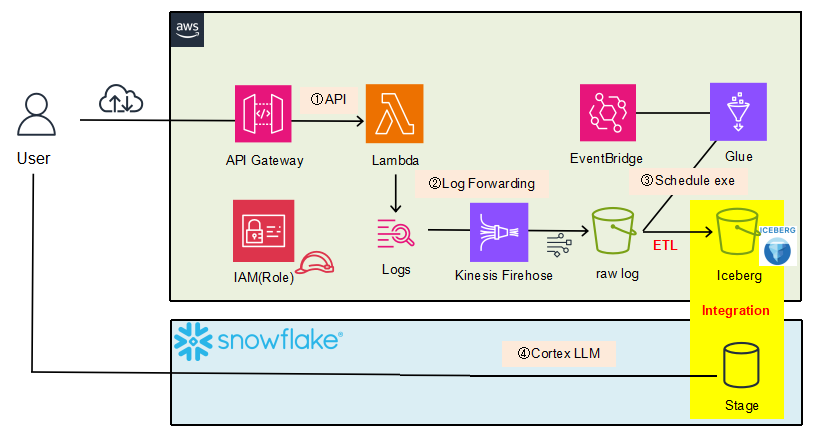
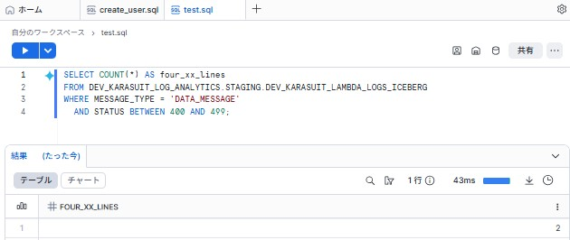
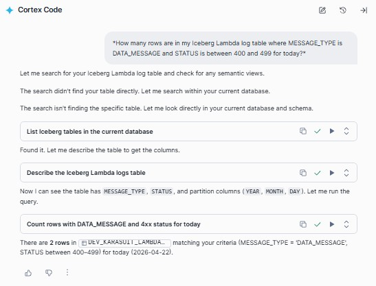

# Internal Lambda Troubleshooting Platform (AWS + Snowflake)

*Demo pipeline: Lambda logs → S3 / Glue Iceberg → Snowflake; Terraform for cross-cloud IAM trust; **Cortex Code** for natural-language SQL on Iceberg (no raw-log export to external LLMs).*

**What I built:** End-to-end pipeline: **API Gateway → Lambda → CloudWatch → Firehose → S3 → Glue (Iceberg, Glue Catalog) → Snowflake**, with **Terraform** wiring **Snowflake storage/catalog trust** to **AWS IAM** via `terraform_remote_state` and an ordered apply sequence.

**Why this stack:** Incident logs should stay under **AWS + Snowflake** control. **Snowflake Cortex Code** drafts SQL from English on top of the **Iceberg** table—without treating raw logs as an export to an external chat LLM.

**What was hard:** **Cross-cloud trust**—separate `sts:ExternalId` paths for storage, Glue catalog, and external volume; feeding Snowflake-described principals into AWS policies without hand-editing trust JSON each time.

---

## Outcomes (what works in this repo)

- **Ingest & lake:** Lambda logs land in S3; **Glue** materializes **Apache Iceberg** and registers **`{env}_{project}_log_warehouse.lambda_logs`** in the **Glue Data Catalog**.
- **Consume:** Snowflake **`EXTERNAL VOLUME` + Glue `CATALOG INTEGRATION` + `CREATE ICEBERG TABLE`** (Terraform `snowflake_execute`) reads that table as **Iceberg**, not a one-off Parquet hack.
- **Analytics:** SQL metrics on **`MESSAGE_TYPE`**, **`STATUS`**, **`EVENT_TIME`** (e.g. 4xx row counts, share of non-200 where `STATUS IS NOT NULL`).
- **NL → SQL:** **Cortex Code** produces SQL aligned with hand-written queries; screenshots below show **matching numbers**.
- **Ops:** **GitHub Actions** for AWS vs Snowflake Terraform; **Iceberg DDL** gated behind `create_iceberg_table_ddl` / `TF_VAR_create_iceberg_table_ddl` until Glue has created the table.

---

## Rationale (why these choices)

| Choice | Reason |
|--------|--------|
| **Iceberg on S3 + Glue Catalog** | Open table layout and catalog on AWS; **Snowflake as query engine** without loading everything into Snowflake-native tables first. |
| **Glue Spark for writes** | Fits batch log compaction; **Snowflake** stays read/analytics + Cortex Code. |
| **Separate Terraform state (AWS / Snowflake)** | Clear blast radius; Snowflake outputs (IAM user ARN, external IDs) drive AWS trust **mechanically**. |
| **Cortex Code (not Cortex Analyst here)** | **In scope for this repository:** worksheet-side **NL → SQL** with explicit metrics. **Out of scope:** semantic models, Analyst-style governed BI—different effort, not required to prove the pipeline. |
| **Batch Glue job (`createOrReplace` in job code)** | Acceptable for a **demo / portfolio** path; **not** a claim of minute-level streaming freshness. |
| **Terraform (IaC)** | AWS and Snowflake are **declared in Terraform** (separate roots, remote state, ordered applies) so trust wiring and layout stay **reproducible**—manual trust-policy edits are not the default path. |
| **Cortex Code on governed data** | **NL → SQL stays in Snowflake** on the same **Iceberg** tables as ordinary SQL, so ad-hoc metrics need not go through **external LLM APIs with raw logs**. Snowflake usage is still billed; the point is **governance and a single analytics surface**, not a cost comparison to self-hosted models. |

**Repository scope:** **Personal / dev demonstration.** Production concerns (full observability stack, least-privilege CI roles, multi-region) are intentionally not the focus.

---

## Architecture

1. API Gateway → Lambda (demo-friendly HTTP outcomes)
2. CloudWatch → Kinesis Data Firehose → S3 raw (gzip JSON)
3. EventBridge → **Glue** → S3 **Iceberg** + **Glue Data Catalog**
4. **Snowflake** → SQL + optional **Cortex Code**
5. **Terraform** → Snowflake integrations first, then AWS IAM reading remote state

---

## Cortex Code (metrics + proof)

**Definitions used in demos**

- **4xx rows:** `MESSAGE_TYPE = 'DATA_MESSAGE'` and `STATUS` between **400 and 499** → **`COUNT(*)`** (one structured outcome line per request in this model).
- **Non-200 share:** rows with **`STATUS IS NOT NULL`**, same day filter on **`EVENT_TIME::DATE`** (align session timezone or use **`CONVERT_TIMEZONE`** if needed); percentage where **`STATUS != 200`**.
- After Glue writes, **`ALTER ICEBERG TABLE … REFRESH`** may be needed so Snowflake sees current Iceberg metadata.

**Example prompts (English)**

1. *How many rows are in my Iceberg Lambda log table where MESSAGE_TYPE is DATA_MESSAGE and STATUS is between 400 and 499 for today?*
2. *Among rows where MESSAGE_TYPE is DATA_MESSAGE and STATUS is not null, what percentage have STATUS not equal to 200 for today?*

Give Cortex Code the **fully qualified Iceberg table name** if the session default is ambiguous.

### Evidence (screenshots)

**Demo 1 — baseline.** Hand-written SQL on the Iceberg table; execution and result **before** Cortex Code.

**Demo 2 — match.** Cortex Code; generated SQL and results **align with Demo 1**.

---

## Implementation notes

**Iceberg DDL (two-phase Snowflake)**  
`CREATE ICEBERG TABLE` needs Glue to expose `lambda_logs` first. Typical sequence:

1. `env/dev/snowflake` with `create_iceberg_table_ddl=false`
2. `env/dev/aws` (refresh Glue catalog trust from `DESC CATALOG INTEGRATION` via secrets/TF_VAR as needed)
3. Run the **Glue** job
4. `env/dev/snowflake` with `create_iceberg_table_ddl=true`

**Layout**

- AWS: `env/dev/aws/`, modules `modules/aws/`
- Snowflake: `env/dev/snowflake/`, modules `modules/snowflake/`
- Separate remote state per root (S3 backend)

**CI/CD**

- `auto_aws_apply.yml` — changes under `modules/aws/**`, `env/dev/aws/**`
- `auto_snowflake_apply.yml` — changes under `modules/snowflake/**`, `env/dev/snowflake/**`

**Secrets (typical)**  
AWS keys; Snowflake org/account/password; `SNOWFLAKE_GLUE_CATALOG_USER_ARN` / `SNOWFLAKE_GLUE_CATALOG_EXTERNAL_ID` from `DESC CATALOG INTEGRATION`; optional external-volume fields from `DESC EXTERNAL VOLUME` if state lags.

Snowflake workflow may use **`ACCOUNTADMIN`** for account-level integrations. Iceberg DDL uses the flag above so the first phase does not fail before Glue exists.

---

## License

This repository is released under the [MIT License](LICENSE).
